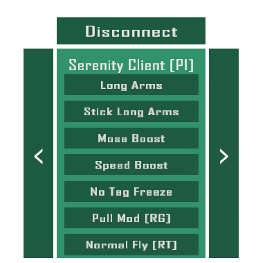

# Serenity-Client
Serenity Client is my passion project where i have challenged myself to make a one script menu for Gorilla Tag Copies.

## Features
### Plug and Play
---
All you have to do is put this script into an empty game object and use it

---
### Automatic Button Creation
---
Want to add more mods? Simple! All you need to do is:
```csharp
void InitMods()
{
    mods.Add(new Mod("Mod Name Here", Function)); //This part tells the Button Creator what to name the button and the Mod Function to bind it to.
}

//Then, down here
void Function()
{
    //do mod stuff
}
```

---
### Pre Loaded Mods
---
Why make a mod menu that doesn't have mods? What's the fun in a slab? Where instead you could have Longer Arms, Faster Running or not get frozen when tagged!

<small>(Thats only the tip of the iceberg ¬u¬)</small>

I've even included mods like:
#### Wall Assist
---
Allows you to go up walls effortlessly and even stick to the wall by gravitating you towards the closest wall by holding `Right Grip`.

---
#### Pull Mod <small>(Made by @sxperx10 on Discord)</small>
---
Makes you stick to the floor a bit easier when holding `Right Grip`, Great for out-running others on ground.

---
#### CosmeticX
---
Unlocks every Cosmetic in the `allCosmetics` list.

---
### This also includes a few rig mods too ;)

## Layout


While yes, it does look like an II's Stupid Template, i can assure you that it was not intentional. Despite that, this is still not the final design and there will be some changes regarding button positions.
## Disclaimer
This product is not affiliated with Another Axiom Inc. or its videogames Gorilla Tag and Orion Drift and is not endorsed or otherwise sponsored by Another Axiom. Portions of the materials contained herein are property of Another Axiom. ©2021 Another Axiom Inc.